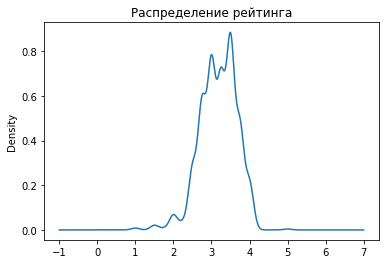
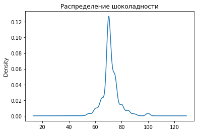
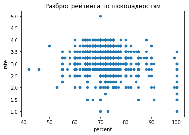
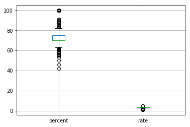
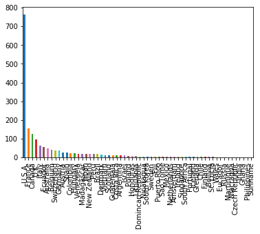
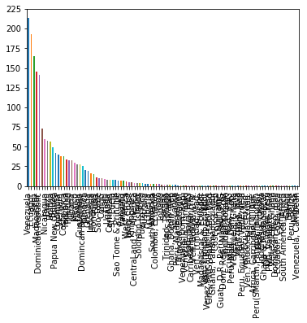
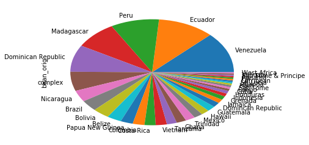
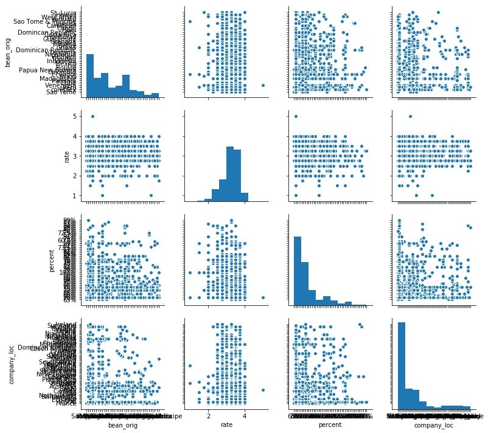

# Сенаев Андрей РИМ-181228
# Первичный анализ и предобработка данных с Pandas

В этом задании рассмотрим первичный анализ данных на примере реальных данных по шоколадным батончикам. Данные содержат следующие атрибуты: 'company' - компания производитель, 'bar_name' - название шоколадного батончика, 'ref' - номер, 'rew_date' - дата оценки, 'percent' - процент какао бобов, 'company_loc' - местонахождение компании, 'rate' - рейтинг, 'bean_dtype' - тип какао бобов, 'bean_orig' - страна происхождения.

## Численные атрибуты


```python
import pandas as pd
import numpy as np
import matplotlib.pyplot as plt
```


```python
best_bar= pd.read_csv('flavors_of_cacao.csv',
                       sep=',', header=0, names=['company', 'bar_name','ref', 'rew_date', 'percent', 'company_loc', 'rate', 'bean_dtype', 'bean_orig'])
```


```python
type(best_bar)
```


    pandas.core.frame.DataFrame


Оставим только только местонахождение компании, рейтинг, процент какао бобов и страну происхождения для дальнейшего анализа.


```python
best_bar = best_bar[['company_loc', 'rate', 'percent', 'bean_orig']]
best_bar.head() 
```


<div>
<style scoped>
    .dataframe tbody tr th:only-of-type {
        vertical-align: middle;
    }

    .dataframe tbody tr th {
        vertical-align: top;
    }

    .dataframe thead th {
        text-align: right;
    }
</style>
<table border="1" class="dataframe">
  <thead>
    <tr style="text-align: right;">
      <th></th>
      <th>company_loc</th>
      <th>rate</th>
      <th>percent</th>
      <th>bean_orig</th>
    </tr>
  </thead>
  <tbody>
    <tr>
      <th>0</th>
      <td>France</td>
      <td>3.75</td>
      <td>63%</td>
      <td>Sao Tome</td>
    </tr>
    <tr>
      <th>1</th>
      <td>France</td>
      <td>2.75</td>
      <td>70%</td>
      <td>Togo</td>
    </tr>
    <tr>
      <th>2</th>
      <td>France</td>
      <td>3.00</td>
      <td>70%</td>
      <td>Togo</td>
    </tr>
    <tr>
      <th>3</th>
      <td>France</td>
      <td>3.50</td>
      <td>70%</td>
      <td>Togo</td>
    </tr>
    <tr>
      <th>4</th>
      <td>France</td>
      <td>3.50</td>
      <td>70%</td>
      <td>Peru</td>
    </tr>
  </tbody>
</table>
</div>


Необходимо построить гистограмму распределения рейтинга батончика через plot(). Количество столбцов гистограммы равно 20.
На одном графике необходимо построить график плотности вероятности, который строится на основе оценки непрерывного распределения вероятности. Гистограммы аппроксимируют комбинацией ядре, т.е. более простых распределений, например нормалього (гауссова). Поэтому графики плотности еще называют ядерной окенки плотности (KDE-kernel density estimate). Строится kde с помощью функции плот с параметром kind='kde'.


```python
rates = best_bar['rate']
rates.plot(kind='kde', title='Распределение рейтинга')
```


    <matplotlib.axes._subplots.AxesSubplot at 0x1a2247f240>





Необходимо построить гистограмму распределения для процента какао бобов. Однако, следует отметить, что данные атрибут имеет тип object. Шистограмму для такого типа построить не получиться.

Необходимо преобразовать данный тип в float с помощью функции apply. Причем сначала необходимо убрать знак '%' в конце каждого элемента, а затем преобразовать в тип данных с плавающей точкой. Функция apply проходит по всем значениям данных и применяет указанную функцию.


```python
def percentToFloat(str):
    return float(str.strip('%'))

chokoPercent = best_bar['percent'].apply(percentToFloat)

percents.plot(kind='kde', title='Распределение шоколадности')
```


    <matplotlib.axes._subplots.AxesSubplot at 0x1a225ace80>





Постройте scatter plot зависимости рейтинга батончика от процента какао бобов, используя метод plot для Pandas DataFrame с аргументом kind='scatter'. Подпишите картинку.


```python
chokoRate = pd.concat([chokoPercent, rates], axis=1)
chokoRate.plot(kind='scatter', x='percent', y='rate', title='Разброс рейтинга по шоколадностям')
```


    <matplotlib.axes._subplots.AxesSubplot at 0x1a22baa0b8>





Постройте "ящик с усами" для числовых распределений с помощью функции boxplot. Возпользуйтесь также функцией describe() для каждого распределения.


```python
chokoRate.boxplot()
```


    <matplotlib.axes._subplots.AxesSubplot at 0x1a2307dac8>





```python
chokoRate.describe()
```


<div>
<style scoped>
    .dataframe tbody tr th:only-of-type {
        vertical-align: middle;
    }

    .dataframe tbody tr th {
        vertical-align: top;
    }

    .dataframe thead th {
        text-align: right;
    }
</style>
<table border="1" class="dataframe">
  <thead>
    <tr style="text-align: right;">
      <th></th>
      <th>percent</th>
      <th>rate</th>
    </tr>
  </thead>
  <tbody>
    <tr>
      <th>count</th>
      <td>1795.000000</td>
      <td>1795.000000</td>
    </tr>
    <tr>
      <th>mean</th>
      <td>71.698329</td>
      <td>3.185933</td>
    </tr>
    <tr>
      <th>std</th>
      <td>6.323118</td>
      <td>0.478062</td>
    </tr>
    <tr>
      <th>min</th>
      <td>42.000000</td>
      <td>1.000000</td>
    </tr>
    <tr>
      <th>25%</th>
      <td>70.000000</td>
      <td>2.875000</td>
    </tr>
    <tr>
      <th>50%</th>
      <td>70.000000</td>
      <td>3.250000</td>
    </tr>
    <tr>
      <th>75%</th>
      <td>75.000000</td>
      <td>3.500000</td>
    </tr>
    <tr>
      <th>max</th>
      <td>100.000000</td>
      <td>5.000000</td>
    </tr>
  </tbody>
</table>
</div>


## Категориальные атрибуты

Обратим внимание на категориальные признаки. Построить гистограмму распределения не удастся, но в качестве начального анализа можно воспользоваться функцией value_counts, которая позволяет вывести количество встречающихся значений в атрибуте данных. Обратите внимание внимание на места происхождения бобов, которые редко встречаются в наборе данных. Для вывода начальных и конечных элементов используются функции head() и tail() соответственно.


```python
locations = best_bar['company_loc']
locationsCounts = locations.value_counts()
locationsCount = len(locationsCounts)
print('locations count', locationsCount)

origins = best_bar['bean_orig']
originsCounts = origins.value_counts()
originsCount = len(originsCounts)
print('origins counts', originsCount)
```

    locations count 60
    origins counts 100


После того, как выведено количество уникальных значений можно представить их визуальное распределение с помощью функции plot(kind='bar').


```python
locationsCounts.plot(kind='bar')
```


    <matplotlib.axes._subplots.AxesSubplot at 0x1a23a33860>





```python
originsCounts.plot(kind='bar')
```


    <matplotlib.axes._subplots.AxesSubplot at 0x1a23a09898>





По гистограмме распределения категориальных атрибутов о происхождения какао бобов можно увидеть, что присутствует хаос в данных. Для некоторых объектов названия мест происхождения написаны с ошибками, у некоторых объектов вообще отсутствует место происхождения, а так же есть батончики, состоящие из какао бобов из разных мест происхождения. В этой связи необходимо произвести предобработку данных для дальнейшего анализа.
Для начала убрать объекты с пропущенными записями, используя функцию dropna. Необходимо отметить, что в качестве параметров функции передается 'axis', где 0 - удалять по строкам (объектам), 1 - удалять по столбцам, 'how', где 'any' - удалять строку или столбец, если есть пустой объект, 'all' - удалять строку или столбец, если все объекты пустые.  


```python
droppedNaNOrigins = best_bar.dropna(axis=0)
droppedNaNOrigins
```


<div>
<style scoped>
    .dataframe tbody tr th:only-of-type {
        vertical-align: middle;
    }

    .dataframe tbody tr th {
        vertical-align: top;
    }

    .dataframe thead th {
        text-align: right;
    }
</style>
<table border="1" class="dataframe">
  <thead>
    <tr style="text-align: right;">
      <th></th>
      <th>company_loc</th>
      <th>rate</th>
      <th>percent</th>
      <th>bean_orig</th>
    </tr>
  </thead>
  <tbody>
    <tr>
      <th>0</th>
      <td>France</td>
      <td>3.75</td>
      <td>63%</td>
      <td>Sao Tome</td>
    </tr>
    <tr>
      <th>1</th>
      <td>France</td>
      <td>2.75</td>
      <td>70%</td>
      <td>Togo</td>
    </tr>
    <tr>
      <th>2</th>
      <td>France</td>
      <td>3.00</td>
      <td>70%</td>
      <td>Togo</td>
    </tr>
    <tr>
      <th>3</th>
      <td>France</td>
      <td>3.50</td>
      <td>70%</td>
      <td>Togo</td>
    </tr>
    <tr>
      <th>4</th>
      <td>France</td>
      <td>3.50</td>
      <td>70%</td>
      <td>Peru</td>
    </tr>
    <tr>
      <th>5</th>
      <td>France</td>
      <td>2.75</td>
      <td>70%</td>
      <td>Venezuela</td>
    </tr>
    <tr>
      <th>6</th>
      <td>France</td>
      <td>3.50</td>
      <td>70%</td>
      <td>Cuba</td>
    </tr>
    <tr>
      <th>7</th>
      <td>France</td>
      <td>3.50</td>
      <td>70%</td>
      <td>Venezuela</td>
    </tr>
    <tr>
      <th>8</th>
      <td>France</td>
      <td>3.75</td>
      <td>70%</td>
      <td>Venezuela</td>
    </tr>
    <tr>
      <th>9</th>
      <td>France</td>
      <td>4.00</td>
      <td>70%</td>
      <td>Peru</td>
    </tr>
    <tr>
      <th>10</th>
      <td>France</td>
      <td>2.75</td>
      <td>70%</td>
      <td>Panama</td>
    </tr>
    <tr>
      <th>11</th>
      <td>France</td>
      <td>3.00</td>
      <td>70%</td>
      <td>Madagascar</td>
    </tr>
    <tr>
      <th>12</th>
      <td>France</td>
      <td>3.25</td>
      <td>70%</td>
      <td>Brazil</td>
    </tr>
    <tr>
      <th>13</th>
      <td>France</td>
      <td>3.75</td>
      <td>70%</td>
      <td>Ecuador</td>
    </tr>
    <tr>
      <th>14</th>
      <td>France</td>
      <td>2.75</td>
      <td>70%</td>
      <td>Colombia</td>
    </tr>
    <tr>
      <th>15</th>
      <td>France</td>
      <td>3.00</td>
      <td>70%</td>
      <td>Burma</td>
    </tr>
    <tr>
      <th>16</th>
      <td>France</td>
      <td>3.25</td>
      <td>70%</td>
      <td>Papua New Guinea</td>
    </tr>
    <tr>
      <th>17</th>
      <td>France</td>
      <td>4.00</td>
      <td>70%</td>
      <td>Venezuela</td>
    </tr>
    <tr>
      <th>18</th>
      <td>France</td>
      <td>3.25</td>
      <td>70%</td>
      <td>Peru</td>
    </tr>
    <tr>
      <th>19</th>
      <td>France</td>
      <td>3.50</td>
      <td>70%</td>
      <td>Peru</td>
    </tr>
    <tr>
      <th>20</th>
      <td>France</td>
      <td>4.00</td>
      <td>63%</td>
      <td>Peru</td>
    </tr>
    <tr>
      <th>21</th>
      <td>France</td>
      <td>3.50</td>
      <td>70%</td>
      <td>Bolivia</td>
    </tr>
    <tr>
      <th>22</th>
      <td>France</td>
      <td>3.75</td>
      <td>63%</td>
      <td>Peru</td>
    </tr>
    <tr>
      <th>23</th>
      <td>U.S.A.</td>
      <td>3.75</td>
      <td>70%</td>
      <td>Peru</td>
    </tr>
    <tr>
      <th>24</th>
      <td>U.S.A.</td>
      <td>3.75</td>
      <td>70%</td>
      <td>Peru</td>
    </tr>
    <tr>
      <th>25</th>
      <td>Fiji</td>
      <td>2.75</td>
      <td>60%</td>
      <td>Fiji</td>
    </tr>
    <tr>
      <th>26</th>
      <td>Fiji</td>
      <td>3.25</td>
      <td>80%</td>
      <td>Fiji</td>
    </tr>
    <tr>
      <th>27</th>
      <td>Fiji</td>
      <td>3.50</td>
      <td>88%</td>
      <td>Fiji</td>
    </tr>
    <tr>
      <th>28</th>
      <td>Fiji</td>
      <td>3.50</td>
      <td>72%</td>
      <td>Fiji</td>
    </tr>
    <tr>
      <th>29</th>
      <td>Ecuador</td>
      <td>2.75</td>
      <td>55%</td>
      <td>Ecuador</td>
    </tr>
    <tr>
      <th>...</th>
      <td>...</td>
      <td>...</td>
      <td>...</td>
      <td>...</td>
    </tr>
    <tr>
      <th>1765</th>
      <td>U.S.A.</td>
      <td>3.50</td>
      <td>70%</td>
      <td>Belize</td>
    </tr>
    <tr>
      <th>1766</th>
      <td>U.S.A.</td>
      <td>3.00</td>
      <td>60%</td>
      <td></td>
    </tr>
    <tr>
      <th>1767</th>
      <td>Austria</td>
      <td>3.50</td>
      <td>70%</td>
      <td>Madagascar</td>
    </tr>
    <tr>
      <th>1768</th>
      <td>Austria</td>
      <td>2.75</td>
      <td>70%</td>
      <td>Ecuador</td>
    </tr>
    <tr>
      <th>1769</th>
      <td>Austria</td>
      <td>2.75</td>
      <td>85%</td>
      <td>Trinidad</td>
    </tr>
    <tr>
      <th>1770</th>
      <td>Austria</td>
      <td>3.00</td>
      <td>85%</td>
      <td>Tanzania</td>
    </tr>
    <tr>
      <th>1771</th>
      <td>Austria</td>
      <td>3.50</td>
      <td>70%</td>
      <td>Tanzania</td>
    </tr>
    <tr>
      <th>1772</th>
      <td>Austria</td>
      <td>3.50</td>
      <td>78%</td>
      <td>Trinidad</td>
    </tr>
    <tr>
      <th>1773</th>
      <td>Australia</td>
      <td>3.75</td>
      <td>78%</td>
      <td>Solomon Islands</td>
    </tr>
    <tr>
      <th>1774</th>
      <td>Australia</td>
      <td>3.25</td>
      <td>65%</td>
      <td></td>
    </tr>
    <tr>
      <th>1775</th>
      <td>Australia</td>
      <td>3.50</td>
      <td>68%</td>
      <td>Bolivia</td>
    </tr>
    <tr>
      <th>1776</th>
      <td>Australia</td>
      <td>3.50</td>
      <td>66%</td>
      <td>Papua New Guinea</td>
    </tr>
    <tr>
      <th>1777</th>
      <td>Australia</td>
      <td>3.75</td>
      <td>72%</td>
      <td>Bolivia</td>
    </tr>
    <tr>
      <th>1778</th>
      <td>Austria</td>
      <td>2.75</td>
      <td>80%</td>
      <td></td>
    </tr>
    <tr>
      <th>1779</th>
      <td>Austria</td>
      <td>3.50</td>
      <td>72%</td>
      <td>Panama</td>
    </tr>
    <tr>
      <th>1780</th>
      <td>Austria</td>
      <td>3.50</td>
      <td>65%</td>
      <td></td>
    </tr>
    <tr>
      <th>1781</th>
      <td>Austria</td>
      <td>3.00</td>
      <td>70%</td>
      <td>Peru</td>
    </tr>
    <tr>
      <th>1782</th>
      <td>Austria</td>
      <td>3.50</td>
      <td>70%</td>
      <td>Peru</td>
    </tr>
    <tr>
      <th>1783</th>
      <td>Austria</td>
      <td>3.75</td>
      <td>62%</td>
      <td>Dominican Republic</td>
    </tr>
    <tr>
      <th>1784</th>
      <td>Austria</td>
      <td>3.00</td>
      <td>75%</td>
      <td>Ecuador</td>
    </tr>
    <tr>
      <th>1785</th>
      <td>Austria</td>
      <td>3.00</td>
      <td>75%</td>
      <td>Papua New Guinea</td>
    </tr>
    <tr>
      <th>1786</th>
      <td>Austria</td>
      <td>3.25</td>
      <td>90%</td>
      <td>Bolivia</td>
    </tr>
    <tr>
      <th>1787</th>
      <td>Austria</td>
      <td>3.75</td>
      <td>70%</td>
      <td>Dominican Republic</td>
    </tr>
    <tr>
      <th>1788</th>
      <td>Austria</td>
      <td>3.25</td>
      <td>68%</td>
      <td>Congo</td>
    </tr>
    <tr>
      <th>1789</th>
      <td>Austria</td>
      <td>3.50</td>
      <td>58%</td>
      <td></td>
    </tr>
    <tr>
      <th>1790</th>
      <td>Austria</td>
      <td>3.75</td>
      <td>70%</td>
      <td>Peru</td>
    </tr>
    <tr>
      <th>1791</th>
      <td>Austria</td>
      <td>3.00</td>
      <td>65%</td>
      <td>Congo</td>
    </tr>
    <tr>
      <th>1792</th>
      <td>Austria</td>
      <td>3.50</td>
      <td>65%</td>
      <td>India</td>
    </tr>
    <tr>
      <th>1793</th>
      <td>Austria</td>
      <td>3.25</td>
      <td>62%</td>
      <td>India</td>
    </tr>
    <tr>
      <th>1794</th>
      <td>Austria</td>
      <td>3.00</td>
      <td>65%</td>
      <td>Brazil</td>
    </tr>
  </tbody>
</table>
<p>1794 rows × 4 columns</p>
</div>


Заметим, что пустые записи из атрибута происхождения бобов не удалилсь. Значит "пустые" записи не являются пустыми. Выведите все уникальные значения атрибута 'bean_orig' с помощью функции unique() и найдите значение пустой записи.


```python
droppedNaNOrigins['bean_orig'].unique()
```


    array(['Sao Tome', 'Togo', 'Peru', 'Venezuela', 'Cuba', 'Panama',
           'Madagascar', 'Brazil', 'Ecuador', 'Colombia', 'Burma',
           'Papua New Guinea', 'Bolivia', 'Fiji', 'Mexico', 'Indonesia',
           'Trinidad', 'Vietnam', 'Nicaragua', 'Tanzania',
           'Dominican Republic', 'Ghana', 'Belize', '\xa0', 'Jamaica',
           'Grenada', 'Guatemala', 'Honduras', 'Costa Rica',
           'Domincan Republic', 'Haiti', 'Congo', 'Philippines', 'Malaysia',
           'Dominican Rep., Bali', 'Venez,Africa,Brasil,Peru,Mex', 'Gabon',
           'Ivory Coast', 'Carribean', 'Sri Lanka', 'Puerto Rico', 'Uganda',
           'Martinique', 'Sao Tome & Principe', 'Vanuatu', 'Australia',
           'Liberia', 'Ecuador, Costa Rica', 'West Africa', 'Hawaii',
           'St. Lucia', 'Cost Rica, Ven', 'Peru, Madagascar',
           'Venezuela, Trinidad', 'Trinidad, Tobago',
           'Ven, Trinidad, Ecuador', 'South America, Africa', 'India',
           'Africa, Carribean, C. Am.', 'Tobago', 'Ven., Indonesia, Ecuad.',
           'Trinidad-Tobago', 'Peru, Ecuador, Venezuela',
           'Venezuela, Dom. Rep.', 'Colombia, Ecuador', 'Solomon Islands',
           'Nigeria', 'Peru, Belize', 'Peru, Mad., Dom. Rep.',
           'PNG, Vanuatu, Mad', 'El Salvador', 'South America', 'Samoa',
           'Ghana, Domin. Rep', 'Trinidad, Ecuador', 'Cameroon',
           'Venezuela, Java', 'Venezuela/ Ghana', 'Venezuela, Ghana',
           'Indonesia, Ghana', 'Peru(SMartin,Pangoa,nacional)', 'Principe',
           'Central and S. America', 'Ven., Trinidad, Mad.',
           'Carribean(DR/Jam/Tri)', 'Ghana & Madagascar',
           'Ven.,Ecu.,Peru,Nic.', 'Madagascar & Ecuador',
           'Guat., D.R., Peru, Mad., PNG', 'Peru, Dom. Rep',
           'Dom. Rep., Madagascar', 'Gre., PNG, Haw., Haiti, Mad',
           'Mad., Java, PNG', 'Ven, Bolivia, D.R.', 'DR, Ecuador, Peru',
           'Suriname', 'Peru, Ecuador', 'Ecuador, Mad., PNG',
           'Ghana, Panama, Ecuador', 'Venezuela, Carribean'], dtype=object)


Для того, чтобы исключить данный элемент, необходимо использовать слудующую конструкцию: best_bar['bean_orig'] != 'element value', которая вернет бинарный массив элементов, где True - атрибут объекта не принимает значение 'element value', False - атрибут объекта принимает значение 'element value'. Затем полученную бинарную матрицу передаем в качестве маски, по которой будут выбраны объекты из нашего массива данных.


```python
mask = droppedNaNOrigins['bean_orig'] != '\xa0'

barsWithoutEmptyOrigin = droppedNaNOrigins[mask]

barsWithoutEmptyOrigin
```


<div>
<style scoped>
    .dataframe tbody tr th:only-of-type {
        vertical-align: middle;
    }

    .dataframe tbody tr th {
        vertical-align: top;
    }

    .dataframe thead th {
        text-align: right;
    }
</style>
<table border="1" class="dataframe">
  <thead>
    <tr style="text-align: right;">
      <th></th>
      <th>company_loc</th>
      <th>rate</th>
      <th>percent</th>
      <th>bean_orig</th>
    </tr>
  </thead>
  <tbody>
    <tr>
      <th>0</th>
      <td>France</td>
      <td>3.75</td>
      <td>63%</td>
      <td>Sao Tome</td>
    </tr>
    <tr>
      <th>1</th>
      <td>France</td>
      <td>2.75</td>
      <td>70%</td>
      <td>Togo</td>
    </tr>
    <tr>
      <th>2</th>
      <td>France</td>
      <td>3.00</td>
      <td>70%</td>
      <td>Togo</td>
    </tr>
    <tr>
      <th>3</th>
      <td>France</td>
      <td>3.50</td>
      <td>70%</td>
      <td>Togo</td>
    </tr>
    <tr>
      <th>4</th>
      <td>France</td>
      <td>3.50</td>
      <td>70%</td>
      <td>Peru</td>
    </tr>
    <tr>
      <th>5</th>
      <td>France</td>
      <td>2.75</td>
      <td>70%</td>
      <td>Venezuela</td>
    </tr>
    <tr>
      <th>6</th>
      <td>France</td>
      <td>3.50</td>
      <td>70%</td>
      <td>Cuba</td>
    </tr>
    <tr>
      <th>7</th>
      <td>France</td>
      <td>3.50</td>
      <td>70%</td>
      <td>Venezuela</td>
    </tr>
    <tr>
      <th>8</th>
      <td>France</td>
      <td>3.75</td>
      <td>70%</td>
      <td>Venezuela</td>
    </tr>
    <tr>
      <th>9</th>
      <td>France</td>
      <td>4.00</td>
      <td>70%</td>
      <td>Peru</td>
    </tr>
    <tr>
      <th>10</th>
      <td>France</td>
      <td>2.75</td>
      <td>70%</td>
      <td>Panama</td>
    </tr>
    <tr>
      <th>11</th>
      <td>France</td>
      <td>3.00</td>
      <td>70%</td>
      <td>Madagascar</td>
    </tr>
    <tr>
      <th>12</th>
      <td>France</td>
      <td>3.25</td>
      <td>70%</td>
      <td>Brazil</td>
    </tr>
    <tr>
      <th>13</th>
      <td>France</td>
      <td>3.75</td>
      <td>70%</td>
      <td>Ecuador</td>
    </tr>
    <tr>
      <th>14</th>
      <td>France</td>
      <td>2.75</td>
      <td>70%</td>
      <td>Colombia</td>
    </tr>
    <tr>
      <th>15</th>
      <td>France</td>
      <td>3.00</td>
      <td>70%</td>
      <td>Burma</td>
    </tr>
    <tr>
      <th>16</th>
      <td>France</td>
      <td>3.25</td>
      <td>70%</td>
      <td>Papua New Guinea</td>
    </tr>
    <tr>
      <th>17</th>
      <td>France</td>
      <td>4.00</td>
      <td>70%</td>
      <td>Venezuela</td>
    </tr>
    <tr>
      <th>18</th>
      <td>France</td>
      <td>3.25</td>
      <td>70%</td>
      <td>Peru</td>
    </tr>
    <tr>
      <th>19</th>
      <td>France</td>
      <td>3.50</td>
      <td>70%</td>
      <td>Peru</td>
    </tr>
    <tr>
      <th>20</th>
      <td>France</td>
      <td>4.00</td>
      <td>63%</td>
      <td>Peru</td>
    </tr>
    <tr>
      <th>21</th>
      <td>France</td>
      <td>3.50</td>
      <td>70%</td>
      <td>Bolivia</td>
    </tr>
    <tr>
      <th>22</th>
      <td>France</td>
      <td>3.75</td>
      <td>63%</td>
      <td>Peru</td>
    </tr>
    <tr>
      <th>23</th>
      <td>U.S.A.</td>
      <td>3.75</td>
      <td>70%</td>
      <td>Peru</td>
    </tr>
    <tr>
      <th>24</th>
      <td>U.S.A.</td>
      <td>3.75</td>
      <td>70%</td>
      <td>Peru</td>
    </tr>
    <tr>
      <th>25</th>
      <td>Fiji</td>
      <td>2.75</td>
      <td>60%</td>
      <td>Fiji</td>
    </tr>
    <tr>
      <th>26</th>
      <td>Fiji</td>
      <td>3.25</td>
      <td>80%</td>
      <td>Fiji</td>
    </tr>
    <tr>
      <th>27</th>
      <td>Fiji</td>
      <td>3.50</td>
      <td>88%</td>
      <td>Fiji</td>
    </tr>
    <tr>
      <th>28</th>
      <td>Fiji</td>
      <td>3.50</td>
      <td>72%</td>
      <td>Fiji</td>
    </tr>
    <tr>
      <th>29</th>
      <td>Ecuador</td>
      <td>2.75</td>
      <td>55%</td>
      <td>Ecuador</td>
    </tr>
    <tr>
      <th>...</th>
      <td>...</td>
      <td>...</td>
      <td>...</td>
      <td>...</td>
    </tr>
    <tr>
      <th>1760</th>
      <td>U.S.A.</td>
      <td>2.50</td>
      <td>70%</td>
      <td>Dominican Republic</td>
    </tr>
    <tr>
      <th>1761</th>
      <td>U.S.A.</td>
      <td>3.00</td>
      <td>70%</td>
      <td>Papua New Guinea</td>
    </tr>
    <tr>
      <th>1762</th>
      <td>U.S.A.</td>
      <td>3.25</td>
      <td>70%</td>
      <td>Domincan Republic</td>
    </tr>
    <tr>
      <th>1763</th>
      <td>U.S.A.</td>
      <td>3.25</td>
      <td>70%</td>
      <td>Madagascar</td>
    </tr>
    <tr>
      <th>1764</th>
      <td>U.S.A.</td>
      <td>3.25</td>
      <td>70%</td>
      <td>Peru</td>
    </tr>
    <tr>
      <th>1765</th>
      <td>U.S.A.</td>
      <td>3.50</td>
      <td>70%</td>
      <td>Belize</td>
    </tr>
    <tr>
      <th>1767</th>
      <td>Austria</td>
      <td>3.50</td>
      <td>70%</td>
      <td>Madagascar</td>
    </tr>
    <tr>
      <th>1768</th>
      <td>Austria</td>
      <td>2.75</td>
      <td>70%</td>
      <td>Ecuador</td>
    </tr>
    <tr>
      <th>1769</th>
      <td>Austria</td>
      <td>2.75</td>
      <td>85%</td>
      <td>Trinidad</td>
    </tr>
    <tr>
      <th>1770</th>
      <td>Austria</td>
      <td>3.00</td>
      <td>85%</td>
      <td>Tanzania</td>
    </tr>
    <tr>
      <th>1771</th>
      <td>Austria</td>
      <td>3.50</td>
      <td>70%</td>
      <td>Tanzania</td>
    </tr>
    <tr>
      <th>1772</th>
      <td>Austria</td>
      <td>3.50</td>
      <td>78%</td>
      <td>Trinidad</td>
    </tr>
    <tr>
      <th>1773</th>
      <td>Australia</td>
      <td>3.75</td>
      <td>78%</td>
      <td>Solomon Islands</td>
    </tr>
    <tr>
      <th>1775</th>
      <td>Australia</td>
      <td>3.50</td>
      <td>68%</td>
      <td>Bolivia</td>
    </tr>
    <tr>
      <th>1776</th>
      <td>Australia</td>
      <td>3.50</td>
      <td>66%</td>
      <td>Papua New Guinea</td>
    </tr>
    <tr>
      <th>1777</th>
      <td>Australia</td>
      <td>3.75</td>
      <td>72%</td>
      <td>Bolivia</td>
    </tr>
    <tr>
      <th>1779</th>
      <td>Austria</td>
      <td>3.50</td>
      <td>72%</td>
      <td>Panama</td>
    </tr>
    <tr>
      <th>1781</th>
      <td>Austria</td>
      <td>3.00</td>
      <td>70%</td>
      <td>Peru</td>
    </tr>
    <tr>
      <th>1782</th>
      <td>Austria</td>
      <td>3.50</td>
      <td>70%</td>
      <td>Peru</td>
    </tr>
    <tr>
      <th>1783</th>
      <td>Austria</td>
      <td>3.75</td>
      <td>62%</td>
      <td>Dominican Republic</td>
    </tr>
    <tr>
      <th>1784</th>
      <td>Austria</td>
      <td>3.00</td>
      <td>75%</td>
      <td>Ecuador</td>
    </tr>
    <tr>
      <th>1785</th>
      <td>Austria</td>
      <td>3.00</td>
      <td>75%</td>
      <td>Papua New Guinea</td>
    </tr>
    <tr>
      <th>1786</th>
      <td>Austria</td>
      <td>3.25</td>
      <td>90%</td>
      <td>Bolivia</td>
    </tr>
    <tr>
      <th>1787</th>
      <td>Austria</td>
      <td>3.75</td>
      <td>70%</td>
      <td>Dominican Republic</td>
    </tr>
    <tr>
      <th>1788</th>
      <td>Austria</td>
      <td>3.25</td>
      <td>68%</td>
      <td>Congo</td>
    </tr>
    <tr>
      <th>1790</th>
      <td>Austria</td>
      <td>3.75</td>
      <td>70%</td>
      <td>Peru</td>
    </tr>
    <tr>
      <th>1791</th>
      <td>Austria</td>
      <td>3.00</td>
      <td>65%</td>
      <td>Congo</td>
    </tr>
    <tr>
      <th>1792</th>
      <td>Austria</td>
      <td>3.50</td>
      <td>65%</td>
      <td>India</td>
    </tr>
    <tr>
      <th>1793</th>
      <td>Austria</td>
      <td>3.25</td>
      <td>62%</td>
      <td>India</td>
    </tr>
    <tr>
      <th>1794</th>
      <td>Austria</td>
      <td>3.00</td>
      <td>65%</td>
      <td>Brazil</td>
    </tr>
  </tbody>
</table>
<p>1721 rows × 4 columns</p>
</div>


Помимо этого необходимо решить проблему с батончиками из разных какао бобов. Лучшим способом является обработка и разделение этих составных бобов. Но на данном этапе, в виду их малого вклада, мы уберем их и сделаем одним видом сложного состава 'complex'. Будем считать редковстречающимися, если в выборке их не более 5.


```python
lessThanFife = barsWithoutEmptyOrigin['bean_orig'].value_counts() <= 5

def getIfBarOriginHasLessThanFifeBars(bar):
    return lessThanFife[bar]

lessThanFifeMask = barsWithoutEmptyOrigin['bean_orig'].apply(getIfBarOriginHasLessThanFifeBars)
newOrigins = barsWithoutEmptyOrigin['bean_orig'].mask(lessThanFifeMask, 'complex')

barsWithoutEmptyOrigin.assign(bean_orig=newOrigins)
```


<div>
<style scoped>
    .dataframe tbody tr th:only-of-type {
        vertical-align: middle;
    }

    .dataframe tbody tr th {
        vertical-align: top;
    }

    .dataframe thead th {
        text-align: right;
    }
</style>
<table border="1" class="dataframe">
  <thead>
    <tr style="text-align: right;">
      <th></th>
      <th>company_loc</th>
      <th>rate</th>
      <th>percent</th>
      <th>bean_orig</th>
    </tr>
  </thead>
  <tbody>
    <tr>
      <th>0</th>
      <td>France</td>
      <td>3.75</td>
      <td>63%</td>
      <td>Sao Tome</td>
    </tr>
    <tr>
      <th>1</th>
      <td>France</td>
      <td>2.75</td>
      <td>70%</td>
      <td>complex</td>
    </tr>
    <tr>
      <th>2</th>
      <td>France</td>
      <td>3.00</td>
      <td>70%</td>
      <td>complex</td>
    </tr>
    <tr>
      <th>3</th>
      <td>France</td>
      <td>3.50</td>
      <td>70%</td>
      <td>complex</td>
    </tr>
    <tr>
      <th>4</th>
      <td>France</td>
      <td>3.50</td>
      <td>70%</td>
      <td>Peru</td>
    </tr>
    <tr>
      <th>5</th>
      <td>France</td>
      <td>2.75</td>
      <td>70%</td>
      <td>Venezuela</td>
    </tr>
    <tr>
      <th>6</th>
      <td>France</td>
      <td>3.50</td>
      <td>70%</td>
      <td>Cuba</td>
    </tr>
    <tr>
      <th>7</th>
      <td>France</td>
      <td>3.50</td>
      <td>70%</td>
      <td>Venezuela</td>
    </tr>
    <tr>
      <th>8</th>
      <td>France</td>
      <td>3.75</td>
      <td>70%</td>
      <td>Venezuela</td>
    </tr>
    <tr>
      <th>9</th>
      <td>France</td>
      <td>4.00</td>
      <td>70%</td>
      <td>Peru</td>
    </tr>
    <tr>
      <th>10</th>
      <td>France</td>
      <td>2.75</td>
      <td>70%</td>
      <td>Panama</td>
    </tr>
    <tr>
      <th>11</th>
      <td>France</td>
      <td>3.00</td>
      <td>70%</td>
      <td>Madagascar</td>
    </tr>
    <tr>
      <th>12</th>
      <td>France</td>
      <td>3.25</td>
      <td>70%</td>
      <td>Brazil</td>
    </tr>
    <tr>
      <th>13</th>
      <td>France</td>
      <td>3.75</td>
      <td>70%</td>
      <td>Ecuador</td>
    </tr>
    <tr>
      <th>14</th>
      <td>France</td>
      <td>2.75</td>
      <td>70%</td>
      <td>Colombia</td>
    </tr>
    <tr>
      <th>15</th>
      <td>France</td>
      <td>3.00</td>
      <td>70%</td>
      <td>complex</td>
    </tr>
    <tr>
      <th>16</th>
      <td>France</td>
      <td>3.25</td>
      <td>70%</td>
      <td>Papua New Guinea</td>
    </tr>
    <tr>
      <th>17</th>
      <td>France</td>
      <td>4.00</td>
      <td>70%</td>
      <td>Venezuela</td>
    </tr>
    <tr>
      <th>18</th>
      <td>France</td>
      <td>3.25</td>
      <td>70%</td>
      <td>Peru</td>
    </tr>
    <tr>
      <th>19</th>
      <td>France</td>
      <td>3.50</td>
      <td>70%</td>
      <td>Peru</td>
    </tr>
    <tr>
      <th>20</th>
      <td>France</td>
      <td>4.00</td>
      <td>63%</td>
      <td>Peru</td>
    </tr>
    <tr>
      <th>21</th>
      <td>France</td>
      <td>3.50</td>
      <td>70%</td>
      <td>Bolivia</td>
    </tr>
    <tr>
      <th>22</th>
      <td>France</td>
      <td>3.75</td>
      <td>63%</td>
      <td>Peru</td>
    </tr>
    <tr>
      <th>23</th>
      <td>U.S.A.</td>
      <td>3.75</td>
      <td>70%</td>
      <td>Peru</td>
    </tr>
    <tr>
      <th>24</th>
      <td>U.S.A.</td>
      <td>3.75</td>
      <td>70%</td>
      <td>Peru</td>
    </tr>
    <tr>
      <th>25</th>
      <td>Fiji</td>
      <td>2.75</td>
      <td>60%</td>
      <td>Fiji</td>
    </tr>
    <tr>
      <th>26</th>
      <td>Fiji</td>
      <td>3.25</td>
      <td>80%</td>
      <td>Fiji</td>
    </tr>
    <tr>
      <th>27</th>
      <td>Fiji</td>
      <td>3.50</td>
      <td>88%</td>
      <td>Fiji</td>
    </tr>
    <tr>
      <th>28</th>
      <td>Fiji</td>
      <td>3.50</td>
      <td>72%</td>
      <td>Fiji</td>
    </tr>
    <tr>
      <th>29</th>
      <td>Ecuador</td>
      <td>2.75</td>
      <td>55%</td>
      <td>Ecuador</td>
    </tr>
    <tr>
      <th>...</th>
      <td>...</td>
      <td>...</td>
      <td>...</td>
      <td>...</td>
    </tr>
    <tr>
      <th>1760</th>
      <td>U.S.A.</td>
      <td>2.50</td>
      <td>70%</td>
      <td>Dominican Republic</td>
    </tr>
    <tr>
      <th>1761</th>
      <td>U.S.A.</td>
      <td>3.00</td>
      <td>70%</td>
      <td>Papua New Guinea</td>
    </tr>
    <tr>
      <th>1762</th>
      <td>U.S.A.</td>
      <td>3.25</td>
      <td>70%</td>
      <td>Domincan Republic</td>
    </tr>
    <tr>
      <th>1763</th>
      <td>U.S.A.</td>
      <td>3.25</td>
      <td>70%</td>
      <td>Madagascar</td>
    </tr>
    <tr>
      <th>1764</th>
      <td>U.S.A.</td>
      <td>3.25</td>
      <td>70%</td>
      <td>Peru</td>
    </tr>
    <tr>
      <th>1765</th>
      <td>U.S.A.</td>
      <td>3.50</td>
      <td>70%</td>
      <td>Belize</td>
    </tr>
    <tr>
      <th>1767</th>
      <td>Austria</td>
      <td>3.50</td>
      <td>70%</td>
      <td>Madagascar</td>
    </tr>
    <tr>
      <th>1768</th>
      <td>Austria</td>
      <td>2.75</td>
      <td>70%</td>
      <td>Ecuador</td>
    </tr>
    <tr>
      <th>1769</th>
      <td>Austria</td>
      <td>2.75</td>
      <td>85%</td>
      <td>Trinidad</td>
    </tr>
    <tr>
      <th>1770</th>
      <td>Austria</td>
      <td>3.00</td>
      <td>85%</td>
      <td>Tanzania</td>
    </tr>
    <tr>
      <th>1771</th>
      <td>Austria</td>
      <td>3.50</td>
      <td>70%</td>
      <td>Tanzania</td>
    </tr>
    <tr>
      <th>1772</th>
      <td>Austria</td>
      <td>3.50</td>
      <td>78%</td>
      <td>Trinidad</td>
    </tr>
    <tr>
      <th>1773</th>
      <td>Australia</td>
      <td>3.75</td>
      <td>78%</td>
      <td>complex</td>
    </tr>
    <tr>
      <th>1775</th>
      <td>Australia</td>
      <td>3.50</td>
      <td>68%</td>
      <td>Bolivia</td>
    </tr>
    <tr>
      <th>1776</th>
      <td>Australia</td>
      <td>3.50</td>
      <td>66%</td>
      <td>Papua New Guinea</td>
    </tr>
    <tr>
      <th>1777</th>
      <td>Australia</td>
      <td>3.75</td>
      <td>72%</td>
      <td>Bolivia</td>
    </tr>
    <tr>
      <th>1779</th>
      <td>Austria</td>
      <td>3.50</td>
      <td>72%</td>
      <td>Panama</td>
    </tr>
    <tr>
      <th>1781</th>
      <td>Austria</td>
      <td>3.00</td>
      <td>70%</td>
      <td>Peru</td>
    </tr>
    <tr>
      <th>1782</th>
      <td>Austria</td>
      <td>3.50</td>
      <td>70%</td>
      <td>Peru</td>
    </tr>
    <tr>
      <th>1783</th>
      <td>Austria</td>
      <td>3.75</td>
      <td>62%</td>
      <td>Dominican Republic</td>
    </tr>
    <tr>
      <th>1784</th>
      <td>Austria</td>
      <td>3.00</td>
      <td>75%</td>
      <td>Ecuador</td>
    </tr>
    <tr>
      <th>1785</th>
      <td>Austria</td>
      <td>3.00</td>
      <td>75%</td>
      <td>Papua New Guinea</td>
    </tr>
    <tr>
      <th>1786</th>
      <td>Austria</td>
      <td>3.25</td>
      <td>90%</td>
      <td>Bolivia</td>
    </tr>
    <tr>
      <th>1787</th>
      <td>Austria</td>
      <td>3.75</td>
      <td>70%</td>
      <td>Dominican Republic</td>
    </tr>
    <tr>
      <th>1788</th>
      <td>Austria</td>
      <td>3.25</td>
      <td>68%</td>
      <td>Congo</td>
    </tr>
    <tr>
      <th>1790</th>
      <td>Austria</td>
      <td>3.75</td>
      <td>70%</td>
      <td>Peru</td>
    </tr>
    <tr>
      <th>1791</th>
      <td>Austria</td>
      <td>3.00</td>
      <td>65%</td>
      <td>Congo</td>
    </tr>
    <tr>
      <th>1792</th>
      <td>Austria</td>
      <td>3.50</td>
      <td>65%</td>
      <td>complex</td>
    </tr>
    <tr>
      <th>1793</th>
      <td>Austria</td>
      <td>3.25</td>
      <td>62%</td>
      <td>complex</td>
    </tr>
    <tr>
      <th>1794</th>
      <td>Austria</td>
      <td>3.00</td>
      <td>65%</td>
      <td>Brazil</td>
    </tr>
  </tbody>
</table>
<p>1721 rows × 4 columns</p>
</div>


Постройте круговую гистограмму распределения для стран происзводителей какао бобов с помощью функции pie().


```python
barsWithoutEmptyOrigin['bean_orig'].value_counts().plot.pie()
```


    <matplotlib.axes._subplots.AxesSubplot at 0x1a2356f908>





## Попарные графики распределений


```python
from sklearn import preprocessing
from seaborn import pairplot
```

Построить попарные распределения для всех признаков.


```python
pairplot(barsWithoutEmptyOrigin, vars=['bean_orig', 'rate', 'percent', 'company_loc'])
```


    <seaborn.axisgrid.PairGrid at 0x1a2656aac8>





Определите, где растут лучшие какао бобы, вычислив средний значение и медиану рейтинга батончика для каждого места происхождения. Напишите первую тройку лучших в обоих случаях.


```python
averageRatings = barsWithoutEmptyOrigin.groupby(['bean_orig']).mean()
averageRatings.sort_values(by='rate', ascending=False).head(3)
```


<div>
<style scoped>
    .dataframe tbody tr th:only-of-type {
        vertical-align: middle;
    }

    .dataframe tbody tr th {
        vertical-align: top;
    }

    .dataframe thead th {
        text-align: right;
    }
</style>
<table border="1" class="dataframe">
  <thead>
    <tr style="text-align: right;">
      <th></th>
      <th>rate</th>
    </tr>
    <tr>
      <th>bean_orig</th>
      <th></th>
    </tr>
  </thead>
  <tbody>
    <tr>
      <th>Haiti</th>
      <td>3.388889</td>
    </tr>
    <tr>
      <th>Honduras</th>
      <td>3.350000</td>
    </tr>
    <tr>
      <th>Congo</th>
      <td>3.325000</td>
    </tr>
  </tbody>
</table>
</div>


```python
averageRatings = barsWithoutEmptyOrigin.groupby(['bean_orig']).median()
averageRatings.sort_values(by='rate', ascending=False).head(3)
```


<div>
<style scoped>
    .dataframe tbody tr th:only-of-type {
        vertical-align: middle;
    }

    .dataframe tbody tr th {
        vertical-align: top;
    }

    .dataframe thead th {
        text-align: right;
    }
</style>
<table border="1" class="dataframe">
  <thead>
    <tr style="text-align: right;">
      <th></th>
      <th>rate</th>
    </tr>
    <tr>
      <th>bean_orig</th>
      <th></th>
    </tr>
  </thead>
  <tbody>
    <tr>
      <th>Honduras</th>
      <td>3.500</td>
    </tr>
    <tr>
      <th>Sao Tome &amp; Principe</th>
      <td>3.500</td>
    </tr>
    <tr>
      <th>Brazil</th>
      <td>3.375</td>
    </tr>
  </tbody>
</table>
</div>


Определите, где производят лучшие батончики, вычислив средний значение и медиану рейтинга батончика для каждого места происхождения.
